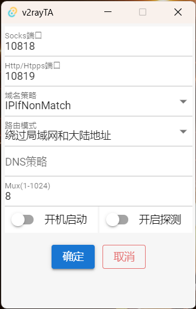

# v2rayTA（开发中）

v2rayTA是基于tauri制作的v2ray gui客户端

目前支持：socks、shadowsocks、vmess

本地代理端口:
- socks：10818
- http/https：10819

目前只支持windows，其他系统等功能都开发差不多了在进行适配吧。

|                              |                              |                              |
| ---------------------------- | ---------------------------- | ---------------------------- |
|  |  |  |

## 功能
- [x] 基本代理服务[开启代理服务、修改v2ray代理端口]
- [x] 实现订阅更新
- [x] 新增代理、删除代理、修改代理信息
- [ ] 实现系统全局代理、开机启动功能 （开发中）
- [ ] 系统托盘菜单切换设置代理
- [ ] 导入导出代理信息(复制导出、剪切板导入、二维码导出) 
- [ ] 实现驱动级别全局代理

## License
[The MIT License (MIT)](https://github.com/tocha688/v2ray-tauri/raw/main/LICENSE)
